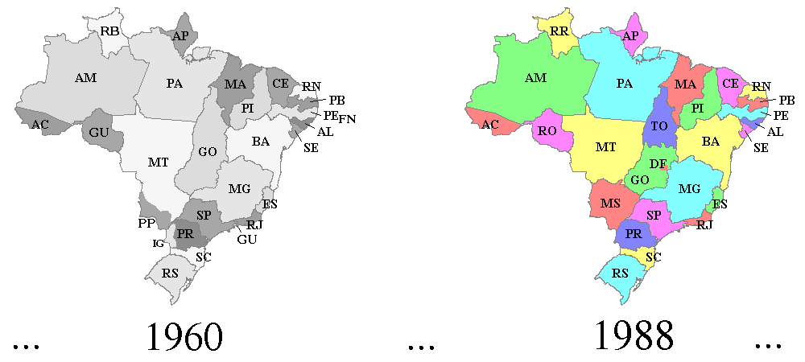
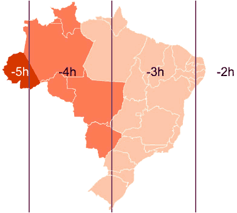

&nbsp; [[validation](http://goodtables.io/github/datasets-br/state-codes) | [view](http://data.okfn.org/tools/view?url=https%3A%2F%2Fraw.githubusercontent.com%2Fdatasets-br%2Fstate-codes%2Fmaster%2Fdatapackage.json)]

# state-codes

Comprehensive Brazilian state code information, including ISO 3166-2:BR codes (the official 2-letter code abbreviations), IBGE state codes,  and "timelines" of each state creation. Provided as a Simple Data Format Data Package (see [datapackage.json visualization](http://data.okfn.org/tools/view?url=https%3A%2F%2Fraw.githubusercontent.com%2Fdatasets-br%2Fstate-codes%2Fmaster%2Fdatapackage.json)).

Strictly, each code designates an *federation unit* ("Unidade da Federação" - UF), that can be a  [state](https://schema.org/State) as usual  country-scale area segmentation, and can be also [capital districts and territories](https://en.wikipedia.org/wiki/Capital_districts_and_territories).

The time-zone conventions are expressed in state-scale, so they are part of this dataset.

&nbsp;&nbsp;&nbsp;&nbsp;&nbsp;&nbsp;&nbsp;&nbsp;

## Collaboration

Please check [`br-state-codes.csv`](data/br-state-codes.csv) for addictions or corrections, editing first at **[this public spreadsheet](https://docs.google.com/spreadsheets/d/1lwuHtCqAsNGxKs0jsnr8G_KBZ7FXekkHn42dHHKfG4M/)**.
Discussions at [git issues](https://github.com/datasets-br/state-codes/issues) (we can chat Portuguese in there!).

See also [ISO 3166-2:BR at Wikipedia](https://en.wikipedia.org/wiki/ISO_3166-2:BR), [ibge.gov.br/estadosat](http://www.ibge.gov.br/estadosat/),  [ibge.gov.br/areaterritorial](http://www.ibge.gov.br/home/geociencias/areaterritorial/principal.shtm), [UFs at Wikipedia](https://pt.wikipedia.org/wiki/Unidades_federativas_do_Brasil).

## Preparation

Download the spreadsheet as CSV, and update *git* with it. When editing *datapackage*, test `python -m json.tool < datapackage.json` before commit.
